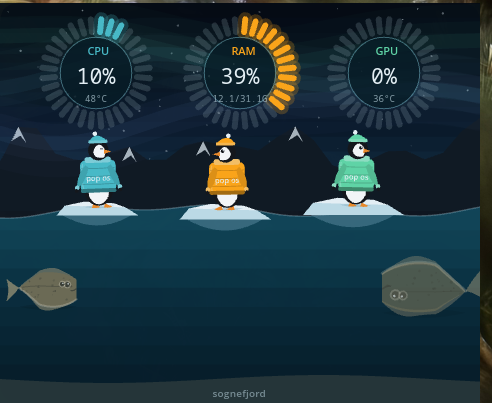

# cosmic-fjord-monitor



A floating system monitor for the COSMIC desktop. CPU, memory and GPU are reported
three ways at once: as ring gauges, and as a Norwegian fjord where the halibut swim
harder under load, the aurora brightens with the GPU, and penguins in Pop!_OS
puffer jackets ride the swell.

Written in Rust with libcosmic. The scene is a single `canvas`, drawn with vector
paths only, so it scales to any surface size and ships no image assets.

## What maps to what

| Metric | Gauge | In the scene |
| --- | --- | --- |
| Busy threads | — | number of halibut on the seabed |
| CPU load | teal ring | how hard the halibut beat their tails |
| Memory | orange ring | swell on the water surface, which the floes ride |
| GPU load | mint ring | — |
| CPU temperature | sub-line under each number | aurora brightness and hue |

## Build

Requires a Wayland compositor that implements `wlr-layer-shell`. COSMIC's
`cosmic-comp` does; GNOME does not, so this will not start on a GNOME session.

```sh
# Pop!_OS / Ubuntu
sudo apt install cargo just cmake libexpat1-dev libfontconfig-dev libfreetype-dev \
                 libxkbcommon-dev pkgconf

just build-release
just install        # /usr/bin/cosmic-fjord-monitor
just autostart      # start it with the session
```

Or just run it in place:

```sh
cargo run --release
```

## Configuration

Settings live in `~/.config/cosmic/io.github.KeyFob133.CosmicFjordMonitor/v1/`, one file
per field, managed by `cosmic-config`. Edits are picked up live: the widget watches
the directory and rebuilds the surface if the geometry changed.

| Key | Default | Notes |
| --- | --- | --- |
| `width`, `height` | `480`, `400` | logical pixels |
| `margin` | `16` | gap from the anchored screen edges |
| `corner` | `TopRight` | `TopRight`, `TopLeft`, `BottomRight`, `BottomLeft` |
| `fps` | `30` | drop to `15` on battery |
| `sample_interval` | `1.0` | seconds; values under `0.2` are clamped |
| `scene` | `true` | `false` renders the gauges alone |
| `penguins` | `3` | 0 to 4 |
| `jacket_text` | `pop os` | printed across each jacket |

Example:

```sh
cd ~/.config/cosmic/io.github.KeyFob133.CosmicFjordMonitor/v1
echo 'false' > scene          # gauges only
echo '"BottomLeft"' > corner
echo '15' > fps
```

## Design notes

**The surface.** `no_main_window(true)` plus one layer surface on `Layer::Bottom`,
anchored to a corner, `exclusive_zone: 0`, and pointer interactivity off. That
combination gives a widget that sits on the desktop, is click-through, and does not
push maximised windows around. Change `Layer::Bottom` to `Layer::Overlay` in
`src/app.rs` if you want it above everything instead.

**Two canvas layers.** Sky, stars, cliffs and their reflection go through a `Cache`
and are drawn once per resize. Aurora, water, wildlife and gauges are redrawn each
frame. Nothing decorative is animated for its own sake — every moving thing is tied
to a number.

**The halibut.** Not a fixed outline. The body is sampled along a spine carrying a
travelling wave, with the fin fringe rippling slightly out of phase with it, so the
fish flexes as it swims. Both eyes sit on one flank, which is the defining feature of
an adult flatfish and the reason it is worth drawing a halibut rather than a
generic fish.

**Determinism.** Star fields, mountain profiles and skin speckles come from a seeded
xorshift, never from a real random source, so the scene is identical on every frame
and every launch.

**Temperatures and GPU.** Read from sysfs (`hwmon`, `gpu_busy_percent`) rather than
through a vendor tool. NVIDIA's proprietary driver exposes no utilisation counter
there, so on those systems the GPU ring stays unlit and reads `n/a` instead of
showing a fabricated zero.

## A note on libcosmic versions

libcosmic has no crates.io release and its layer-shell and canvas APIs move with
upstream iced. `Cargo.toml` tracks `branch = "master"`; pin `rev` to a commit you
have built against before relying on it. If a build breaks, the likely spots are:

- the import paths for `get_layer_surface` / `SctkLayerSurfaceSettings` in
  `src/app.rs`,
- the field list on `SctkLayerSurfaceSettings` (it is constructed with
  `..Default::default()` to absorb additions, but a rename will still bite),
- `cosmic::font::mono()` and `semibold()`, both routed through `src/draw.rs` so
  there is one place to fix,
- the `canvas::Program` signature in `src/scene.rs`.

## Credits

The idea came from a Python system-monitor widget posted to r/pop_os. This is an
independent implementation in Rust on libcosmic, with a different scene and a
different set of mappings.

## Licence

MPL-2.0.
